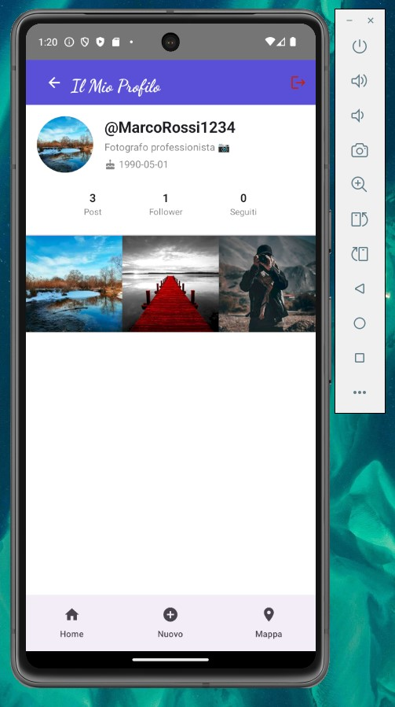
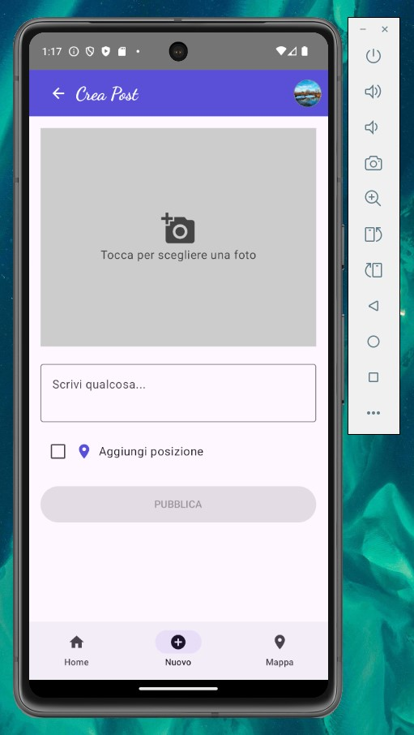
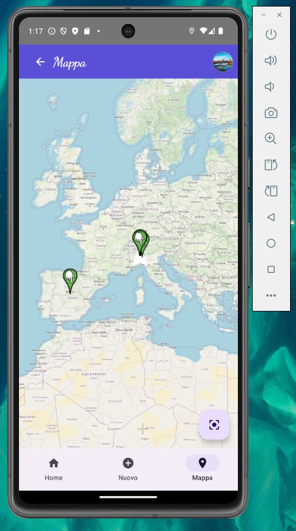
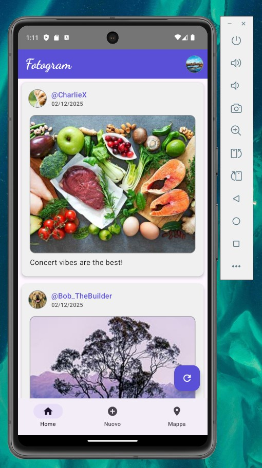

# Fotogram 📸

An Instagram-inspired Android social media app built with **Jetpack Compose** and **Kotlin**. Users can share photos, follow each other, and explore geolocated posts on an interactive map.

---

## Features

- **Photo feed** — Infinite scroll feed with seed-based pagination and offline caching
- **Post creation** — Upload photos with captions and optional GPS location
- **Interactive map** — Browse geolocated posts on an OpenStreetMap-based map
- **User profiles** — View stats (posts / followers / following), post grid, bio
- **Follow system** — Follow and unfollow other users directly from their profile
- **Full-screen viewer** — Tap any image to open a full-screen view with author overlay
- **Offline support** — Feed cached locally with Room; graceful fallback when offline

---

## Tech Stack

| Layer | Technology |
|---|---|
| Language | Kotlin |
| UI | Jetpack Compose + Material 3 |
| Navigation | Compose Navigation |
| Networking | Ktor Client (OkHttp engine) |
| Serialization | Kotlinx Serialization |
| Local database | Room |
| Session storage | DataStore Preferences |
| Image loading | Coil |
| Maps | OSMDroid (OpenStreetMap) |
| Location | Google Play Services (FusedLocationProvider) |

---

## Screenshots

<p align="center">
  
  
  
  
</p>

---

## Architecture

Single-activity app using Jetpack Compose Navigation. The project is organized into clear layers:

```
com.example.fotogram/
├── data/          # API client (Ktor), Room database, session manager
├── model/         # Data classes and DTOs
├── ui/            # Screen composables
├── componenti/    # Reusable UI components (PostCard, ImageGrid, UserProfileHeader)
└── utils/         # Helpers (time formatting, image decoding, distance calc)
```

All network calls go through `CommunicationController`, which wraps the Ktor client and handles authentication via a session ID header. Local caching is managed by a Room database that stores feed posts for offline access.

---

## Getting Started

### Prerequisites
- Android Studio Hedgehog or later
- Android device or emulator with API 24+

### Run the app
1. Clone the repository
   ```bash
   git clone https://github.com/Riccardo-Labs/Fotogram.git
   ```
2. Open the project in Android Studio
3. Sync Gradle and run on a device or emulator

> No API key or backend setup required — the app connects to a shared university server.

---

## API

The app communicates with a REST backend. Key endpoints:

| Method | Endpoint | Description |
|---|---|---|
| POST | `/user` | Register (returns session ID + user ID) |
| PUT | `/user` | Update profile info |
| PUT | `/user/image` | Upload profile picture (Base64 JPEG) |
| POST | `/post` | Create a post |
| GET | `/feed` | Get paginated feed |
| GET | `/post/{id}` | Get post details |
| PUT | `/follow/{userId}` | Follow a user |
| DELETE | `/follow/{userId}` | Unfollow a user |

Authentication is handled via an `x-session-id` header included in every request.

---

## License

This project was developed for educational purposes.
